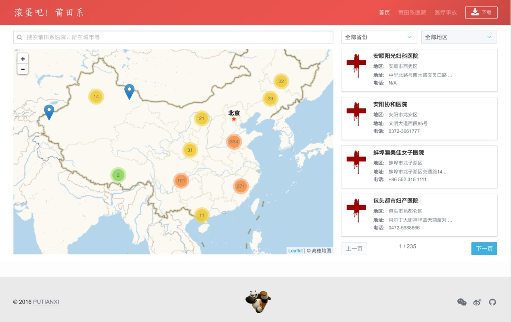

# 滚蛋吧！莆田系



### 项目说明

本项目主要目的是直观列出全国的莆田系医院，让更多的人认识到莆田系医院的危害，并共同抵制莆田系医院以及其帮凶

**项目网址：** [https://putianxi.github.io](https://putianxi.github.io)

**原创数据：** [点此下载](https://github.com/putianxi/putianxi.github.io/raw/master/assets/data/hospital.xlsx)

**数据版权：** [CC 3.0](https://creativecommons.org/licenses/by-nc-sa/3.0/deed.zh)

#### 本项目的数据来源:

- [https://github.com/open-power-workgroup/Hospital](https://github.com/open-power-workgroup/Hospital)
- [https://www.zhihu.com/question/23539856](https://www.zhihu.com/question/23539856)
- [http://happy.dxy.cn/bbs/thread/28771822#28771822](http://happy.dxy.cn/bbs/thread/28771822#28771822)
- [http://money.163.com/16/0502/15/BM2P9I8A00253B0H.html](http://money.163.com/16/0502/15/BM2P9I8A00253B0H.html)
- [http://news.sohu.com/20160503/n447342780.shtml](http://news.sohu.com/20160503/n447342780.shtml)
- [http://www.ptfish.com/thread-731956-1-1.html](http://www.ptfish.com/thread-731956-1-1.html)
- [http://news.ifeng.com/mainland/special/ptxyy/](http://news.ifeng.com/mainland/special/ptxyy/)

### 针对开发者的说明

#### 安装步骤

``` bash
npm install
npm run dev
npm run build
```

通过 [http://127.0.0.1:8080](http://127.0.0.1:8080) 访问

#### 网站使用技术栈

- *JS 框架:* [Vue2.js](https://cn.vuejs.org/)
- *CSS 框架:* [Bulma.io](http://bulma.io/)
- *Ajax:* [axios](https://github.com/axios/axios) 
- *地图:* [Leaflet.js](http://leafletjs.com/)
- *搜索:* [Bloodhound.js](https://github.com/twitter/typeahead.js/blob/master/doc/bloodhound.md)

#### 数据加载与解析

网页在加载时，会异步请求一次 [GeoJson](http://geojson.org/) 数据，然后包括地图、搜索框、sidebar 均使用该数据进行解析和加载。

[地图数据](https://github.com/putianxi/putianxi.github.io/blob/master/assets/data/hospital.geojson) 是由 [Python 脚本](https://github.com/putianxi/putianxi.github.io/blob/master/assets/script/csv2geojson.py) 通过 [CSV文件](https://github.com/putianxi/putianxi.github.io/blob/master/assets/data/hospital.csv) 生成，[CSV文件](https://github.com/putianxi/putianxi.github.io/blob/master/assets/data/hospital.csv) 中包含了 高德地图 和 Google 地图的 MapID，可以在未来做更多的功能开发。
